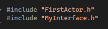
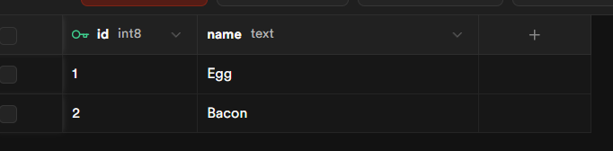
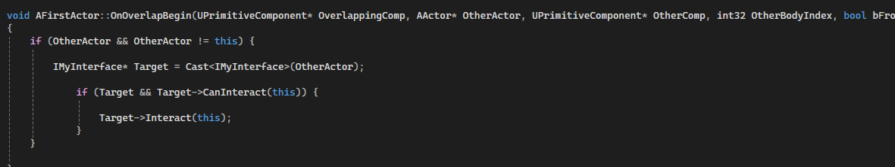
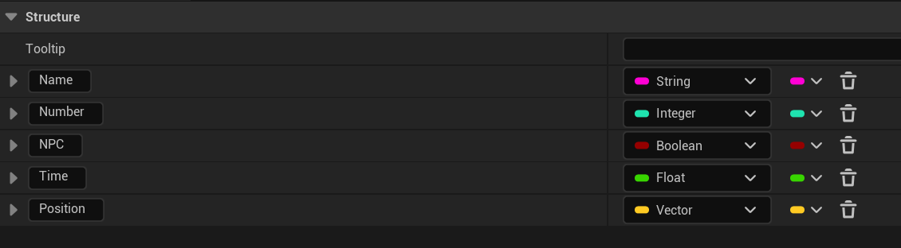
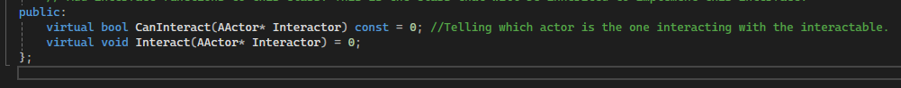
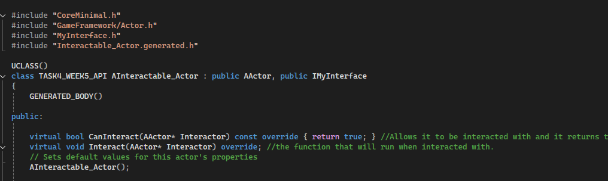
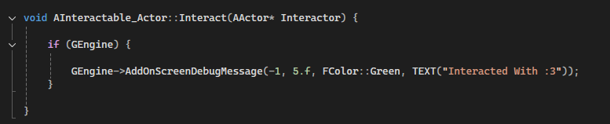

## TASK 4 Interaction System

For the task I created two actors, one with the interface and one without, when the actor overlaps with the interface a message should be sent out. 

Inside the first actor that will contain the interface, in the .h I create the UProperty that is the Sphere Component that serves as the collision box, as well as the UFunction that creates the function that in the actor's .cpp checks if the actor inside the collision contains the CanInteract function, if it does, it will perform that actor's Interact function. In the actor I also made sure it includes the Interface I made. 

The Includes having the Interface made:

Creating the two Functions:

Creating the function that checks if the overlapping Actor can be interact with it:

In the actor's cpp, I also assign all the variables behind the sphere collision, including assigning it that it's a sphere collision, the sphere's size and for it to trigger the OnOverlapBegin when Overlapped with. 

The Sphere Component:

Inside of the Interface's header I gave it to Functions, which is the CanInteract and the Interact, the CanInteract would allow the Actor to be recognised as an Actor that can interact with the other actor's collision and the Interact so that the Actor can perform whatever action it wants to upon interacting. 

The Functions inside of MyInterface's header file:

Inside of the second Actor, "Interactable_Actor" I gave it the include of the Interface and added the Interface into the class so that the Actor could access the CanInteract (and return true) and Interact functions. 

Inside the second actor's header file:

Inside that actor's .cpp file I was able to add the Function of Interact declared in the header file and give the actor some action to perform when interacting with the first actor, where here I decided to have the actor display a message on screen. 

Inside Interactable_Actor's .cpp file:

